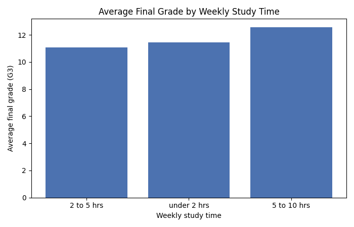
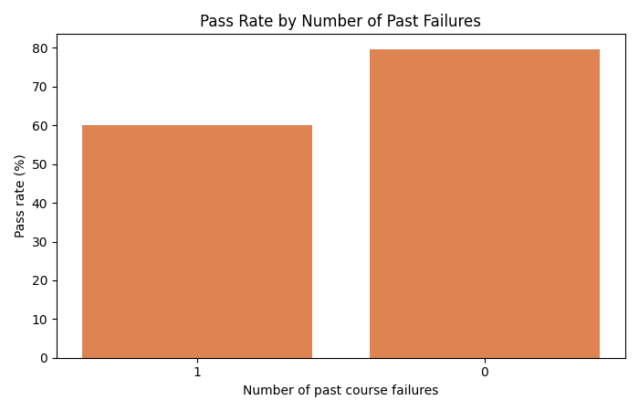

# Overview

I am working toward being a software engineer who is comfortable turning raw data
into an actual answer rather than just a chart, since almost every real product
eventually needs someone to explain what its numbers mean. Data analysis is the
piece of that skill set I have practiced the least, so this project is a deliberate
attempt to close that gap on a small, well-understood dataset before I try it on
something messier and higher stakes, like my own trading robot's trade history.

The dataset is the UCI Machine Learning Repository's Student Performance dataset,
obtained from [archive.ics.uci.edu/dataset/320/student+performance](https://archive.ics.uci.edu/dataset/320/student+performance).
It records 395 secondary school students in a math course, with 33 columns per
student covering study habits, family background, past course failures, extra
school support, and three exam grades.

My purpose in writing this software was to see whether commonly assumed drivers of
a student's grade actually hold up against real data, since I am also building a
study app of my own and did not want to guess at what actually helps a student
improve. I picked this dataset specifically because "how do students learn"
is the problem I am already trying to solve elsewhere, so I wanted a second,
independent source of evidence before trusting my own assumptions about it.

# Data Analysis Results

**Question 1: Does more weekly study time actually raise a student's final grade,
and how does that compare to the effect of past course failures?**

Answer: both move the average final grade, but past course failures move it more.
Across the study time bands with enough students to trust (30 or more), the
average final grade ranges from about 11.1 to 12.6, a spread of roughly 1.5
points. Students with one past failure average 10.15 versus 11.94 for students
with none, a spread of about 1.8 points on a single step. Studying more does
help, but a student's history of failing a course predicts their grade more
strongly than how many hours they currently report studying.

**Question 2: Among students who fail, what separates them from students who
pass?**

Answer: past failures are the clearest signal. The pass rate falls from 79.6%
for students with no past failures to 60.0% for students with one. The second
factor I checked, extra school support, produced a counterintuitive result:
students receiving support pass at 56.0% versus 77.2% for those who do not. That
is not evidence that support causes worse outcomes. School support is assigned
to students who are already struggling, so the comparison reflects who gets
selected for support rather than what the support itself does. I am reporting
that as an important limit on the finding rather than treating it as a clean
answer.

A note on sample sizes: the failures value of 2 and 3 have only 12 and 11
students respectively in this dataset, and the highest study time band has 24.
Rather than report averages built on that few students, my code filters out any
group under 30 students before it aggregates, so those groups do not appear in
the results above or in either chart.

# Development Environment

I developed this software on Windows 11 using Visual Studio Code as my editor,
with the official Microsoft Python extension. I ran and tested the program from
the integrated terminal. Version control is Git, and the repository is hosted on
GitHub.

The program is written in Python 3, using pandas for loading, filtering,
converting, and aggregating the data, and matplotlib for the two charts. One
detail worth documenting: the source CSV files are semicolon separated rather
than comma separated, which has to be passed explicitly to
`pandas.read_csv(path, sep=";")` or every row loads as a single column.

# Useful Websites

* [UCI Machine Learning Repository - Student Performance Dataset](https://archive.ics.uci.edu/dataset/320/student+performance)
* [Pandas Documentation - groupby](https://pandas.pydata.org/docs/reference/groupby.html)
* [Pandas 10 Minute Tutorial](https://pandas.pydata.org/docs/user_guide/10min.html)
* [Matplotlib - Bar Chart Examples](https://matplotlib.org/stable/gallery/lines_bars_and_markers/bar_stacked.html)
* [Markdown Guide - Cheat Sheet](https://www.markdownguide.org/cheat-sheet/)

# Future Work

* Bring in the second dataset file, student-por.csv, and report the two subjects
  separately to see if the same pattern holds outside of math class.
* Answer a third question about whether the relationship between absences and
  final grade differs for students with and without past failures.
* Replace the fixed minimum group size of 30 with a statistical significance
  test, so small-group results are excluded based on a calculated confidence
  level rather than a number I chose by hand.
